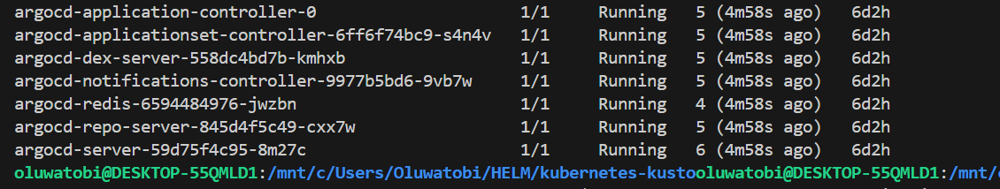
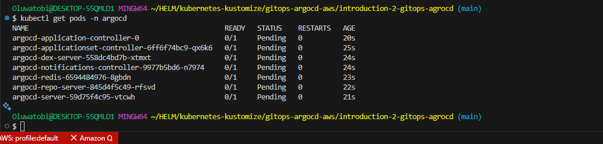
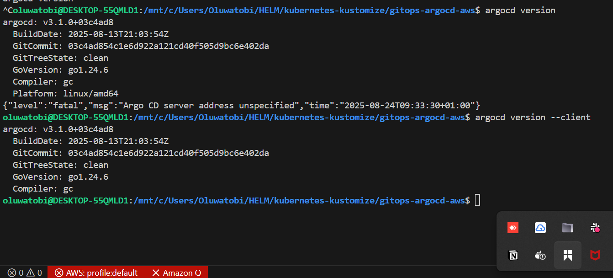
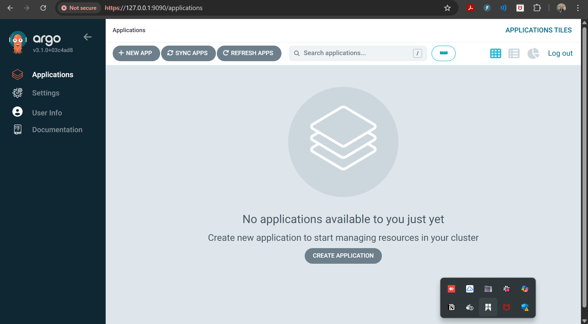
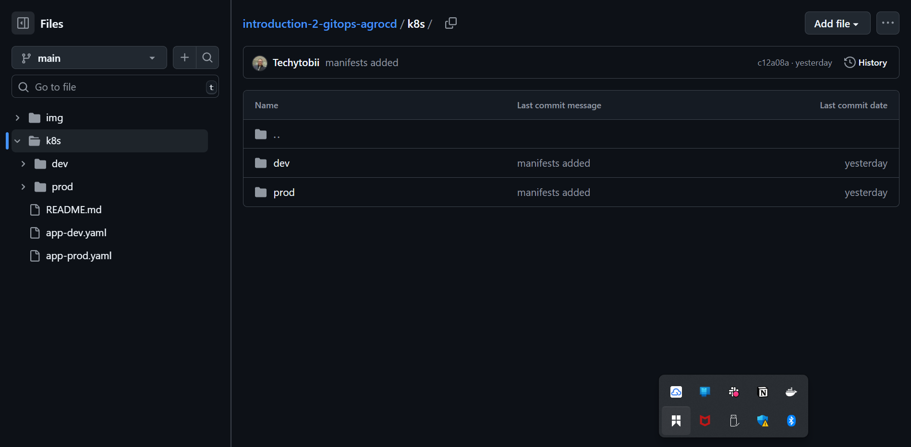
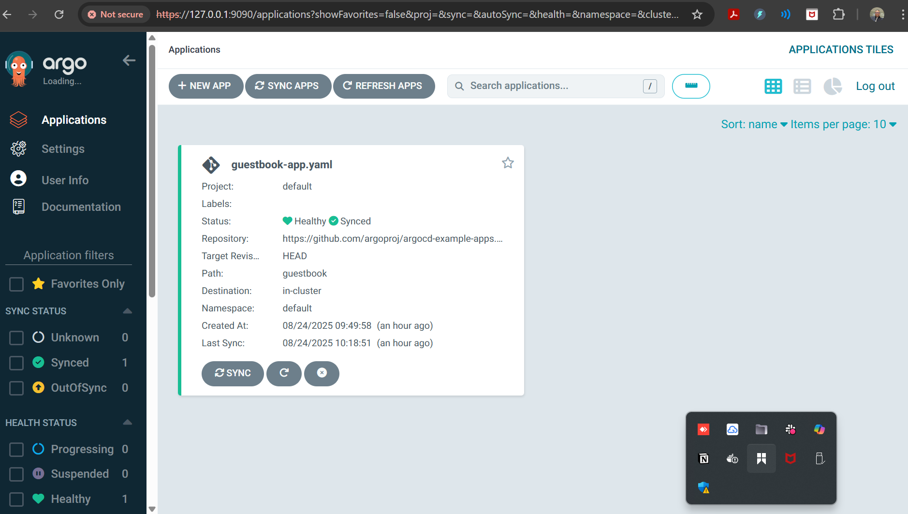

# 🚀 GitOps Project with ArgoCD: Application deployment and Multi-Environment Deployment

---

## 📌 Project Objectives
- Set up **ArgoCD** on a Kubernetes cluster.  
- Deploy a sample NGINX application using **GitOps principles**.  
- Separate configurations for **dev**, **staging**, and **prod** environments.  
- Apply **version control best practices** for clarity, safety, and collaboration.  
- Gain experience in **automated deployments**, **environment isolation**, and **ArgoCD UI usage**.

---

## 🛠️ Prerequisites
Before starting, ensure you have the following:
- A working **Kubernetes cluster** (Minikube, Kind, or EKS/GKE/AKS).  
- **kubectl** CLI installed and connected to your cluster.  
- **Git & GitHub account** (your repo: [introduction-2-gitops-agrocd](https://github.com/Techytobii/introduction-2-gitops-agrocd.git)).  
- **ArgoCD CLI** for managing apps from the terminal.  

> 🖼️ *Placeholder for screenshot: verifying cluster is running with `kubectl get nodes`*  


---

## ⚙️ Installation & Environment Setup

### 1. Install ArgoCD
```bash
kubectl create namespace argocd
kubectl apply -n argocd -f https://raw.githubusercontent.com/argoproj/argo-cd/stable/manifests/install.yaml
Verify installation:
```
Copy code
kubectl get pods -n argocd
- 🖼️ ArgoCD pods running




### 2. Access ArgoCD UI
Port-forward the ArgoCD server:
```
bash
Copy code
kubectl port-forward svc/argocd-server -n argocd 9090:443
URL: http://localhost:9090

Username: admin

Password:

bash
Copy code
kubectl -n argocd get secret argocd-initial-admin-secret \
  -o jsonpath="{.data.password}" | base64 -d && echo
  ```

🖼️ ArgoCD login screen


- 🏗️ Repository Structure

```
Copy code
.
├── k8s/
│   ├── dev/        # Dev environment manifests
│   ├── staging/    # Staging environment manifests
│   └── prod/       # Production environment manifests
├── apps/           # ArgoCD application definitions
└── README.md       # Documentation
```

### 🚀 Implementation Steps

- 1. Create Environment Manifests
Each environment (dev, staging, prod) has its own Deployment and Service files.

Dev → 1 replica

Prod → 2 replicas

🖼️ Repo directory structure in GitHub


2. Define ArgoCD Applications
ArgoCD Applications link Git repo paths to Kubernetes namespaces.

- apps/app-dev.yaml
```
yaml
Copy code
apiVersion: argoproj.io/v1alpha1
kind: Application
metadata:
  name: sample-app-dev
  namespace: argocd
spec:
  project: default
  source:
    repoURL: https://github.com/Techytobii/introduction-2-gitops-agrocd.git
    targetRevision: HEAD
    path: k8s/dev
  destination:
    server: https://kubernetes.default.svc
    namespace: sample-app-dev
  syncPolicy:
    automated: {}
    syncOptions:
      - CreateNamespace=true
```

- apps/app-prod.yaml
```
yaml
Copy code
apiVersion: argoproj.io/v1alpha1
kind: Application
metadata:
  name: sample-app-prod
  namespace: argocd
spec:
  project: default
  source:
    repoURL: https://github.com/Techytobii/introduction-2-gitops-agrocd.git
    targetRevision: HEAD
    path: k8s/prod
  destination:
    server: https://kubernetes.default.svc
    namespace: sample-app-prod
  syncPolicy:
    automated: {}
    syncOptions:
      - CreateNamespace=true
```

- Apply them:
```
bash
Copy code
kubectl apply -f apps/app-dev.yaml -n argocd
kubectl apply -f apps/app-prod.yaml -n argocd
```
* Check:
```
bash
Copy code
kubectl get applications -n argocd
```
🖼️ ArgoCD Applications in UI


3. Test Applications
- Port-forward each service:

```
bash
Copy code
# Dev
kubectl -n sample-app-dev port-forward svc/sample-app 8081:80

# Prod
kubectl -n sample-app-prod port-forward svc/sample-app 8083:80
Access in browser:

Dev → http://localhost:8081

Prod → http://localhost:8083
```

🖼️  NGINX welcome page running in browser


- 🛠️ Environment Separation
We used directory-based separation:
```
Copy code
k8s/dev/       → Dev (1 replica)
k8s/prod/      → Prod (2 replicas)
```
* Ensures clarity.

* Prevents accidental cross-environment changes.

* Each env has its own ArgoCD Application.

- 📌 Version Control Best Practices
Git as the Source of Truth – all manifests stored in Git.

Pull Requests – every change goes via PR with review.

Branch Protection – production (main) is protected.

Tags & Releases – stable releases are tagged (v1.0.0).

Commit Hygiene – clear, atomic commit messages:

```
Copy code
feat(dev): scale replicas from 1 → 2
fix(prod): upgrade nginx version to 1.25.1
```

* 🧩 Challenges Faced
Pods taking too long to become Ready

Fixed by checking image pull speed (kubectl describe pod) and cluster resources.

ArgoCD app OutOfSync

Resolved by enabling automated sync policy in Application manifests.

Namespace missing

Fixed with syncOptions: [CreateNamespace=true].

Private Git repo access

Added repository credentials in ArgoCD settings.

Windows CLI issue (Exec format error)

Fixed by downloading the correct argocd.exe binary for Windows.

* 🧹 Cleanup
To remove the resources:
```
bash
Copy code
kubectl delete -f apps/app-dev.yaml -n argocd
kubectl delete -f apps/app-staging.yaml -n argocd
kubectl delete -f apps/app-prod.yaml -n argocd
kubectl delete ns sample-app-dev sample-app-staging sample-app-prod
```
✅ Summary
Installed ArgoCD in Kubernetes.

Configured multi-environment deployment (dev, staging, prod).

Followed GitOps + version control best practices.

Automated sync ensured continuous delivery directly from Git.

Achieved clear separation, auditability, and safe rollouts.