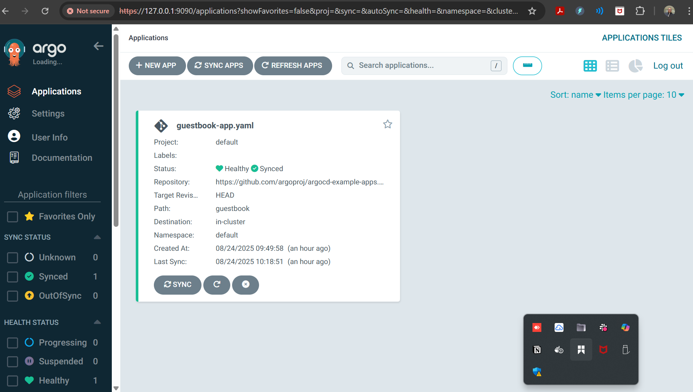
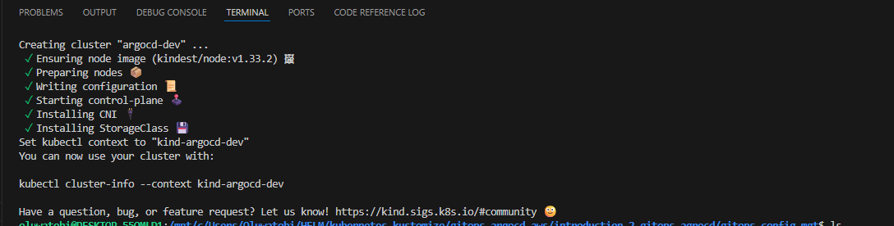
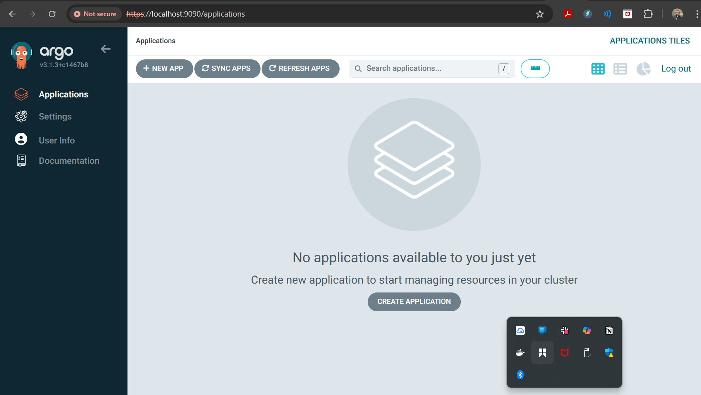
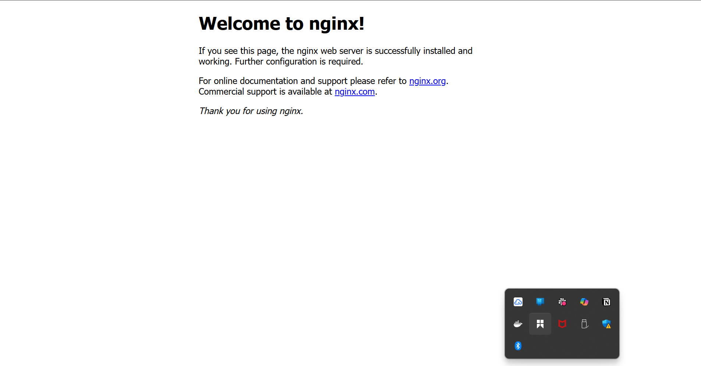

# 📦 Module 3 — Advanced Configuration Management in ArgoCD

### Project Goal: Manage application configuration using Helm and Kustomize with ArgoCD, implement secrets management, and customize resource management & sync policies for safe, reproducible deployments.

### 📘 Overview

In this mini project, you will explore advanced GitOps configuration management practices using ArgoCD.
Specifically, you will:

* Deploy an application using Helm and Kustomize stored in Git.

* Manage secrets securely (SealedSecrets or SOPS).

* Customize resource-difference ignore rules.

* Apply sync policies for automated, safe, and reproducible deployments.


📷 ArgoCD Dashboard showing Synced/Healthy application



### 🎯 Objectives

By the end of this project, you will have:
✅ A Git repository containing a Helm chart and Kustomize overlays.
✅ ArgoCD applications pointing to those configurations.
✅ Encrypted secrets applied safely.
✅ Resource and sync policies correctly configured.
✅ Screenshots and documentation ready for submission.


### ⚙️ Prerequisites

* Git (>= 2.x)

* Docker desktop

* kubectl (>= 1.24)

* ArgoCD CLI (argocd)

* Helm v3+

* kustomize

* Kubernetes cluster (kind, minikube, EKS, GKE, or AKS)

* kubeseal (if using SealedSecrets) or sops

### 📂 Recommended Repository Layout
```
my-argocd-project/
├── README.md
├── helm/
│   └── my-app/
│       ├── Chart.yaml
│       ├── values.yaml
│       └── templates/
├── kustomize/
│   ├── base/
│   │   ├── kustomization.yaml
│   │   ├── deployment.yaml
│   │   └── service.yaml
│   └── overlays/
│       ├── dev/
│       │   └── kustomization.yaml
│       └── prod/
│           └── kustomization.yaml
├── argocd-apps/
│   ├── helm-app.yaml
│   └── kustomize-app.yaml
└── secrets/
    ├── sealedsecret-db.yaml
    └── sops-secrets.yaml
```

📷 Image Placeholder: Repository structure screenshot from IDE

🚀 Step-by-Step Implementation
1) Create Cluster and Environment
kind create cluster --name argocd-dev
# OR
minikube start --driver=docker

2) Install ArgoCD
kubectl create namespace argocd
kubectl apply -n argocd -f https://raw.githubusercontent.com/argoproj/argo-cd/stable/manifests/install.yaml


Access UI:

kubectl port-forward svc/argocd-server -n argocd 9090:443


* 📷 ArgoCD login page screenshot


3) Prepare Helm Chart
cd helm
helm create my-app
helm template my-app

4) Prepare Kustomize Base & Overlays
kubectl kustomize kustomize/base

5) Secrets Management Options

Option A: SealedSecrets (recommended for cluster safety).

Option B: SOPS (advanced encryption).
```
{
  "kind": "SealedSecret",
  "apiVersion": "bitnami.com/v1alpha1",
  "metadata": {
    "name": "db-secret",
    "namespace": "default",
    "creationTimestamp": null
  },
  "spec": {
    "template": {
      "metadata": {
        "name": "db-secret",
        "namespace": "default",
        "creationTimestamp": null
      }
    },
    "encryptedData": {
      "password": "AgCMQr5IY+74X5lOML4AYvKVyBpe7H1cUw4QG2klg7C6vqMxDYt3wVxJG/yk7Ld5BwehqpO8RozndaX0/X8J5/iiq0B+s/CnZLWBoUcfqqiirjRLxYEBBLGVl3jixy8PIQ927vHhXIOXjB1kFmOWKQI+8kIIKw1n6M3zxyI92veQFFpStycr9pOvlMAx0b2SRsQ20ltKiAgPspQ/42Ruj3f9UweLI2kCNeEEmL/vQQ/ftcDc62oyurTzgeTyqGD13Z4pC/Wvg1SzXkjPuhOus7ZS34ji8nTfnlCuU0NlfYB+FAcfss4RZOxjgDfmU1eDvyeOFW9fwfdApUv3jtx5umoCCaGcAfMe+E5kFj7eMe53BNPmvW3YC4S54UR9LUQblTg7hvLKGo3L1dnAfB48oGxXPfEjbAgKFVuMCN6MeUfAp3QeVWOEIsApRppgMn8U99wjfLHoQ0nomGoD2fPbGRCvCujqW5fk/QcDSuRo+RhwuAY4Za2xPaQwd68zDqXIMOABmA+zBZdC9Iz4oSAQggfGKDDzt4oOs3qhuUxYDTP41mu4Ugd1aBZPnjBPp/mlS86zEr+drnW1/zYiB2z0qJ/E8yUmGck+baMgUUGpczqrSIb5Jsk7a4Lnn+AS1bEHZVM1eqxdABjEU6zYzlRp9TDD5jkSUe/6W7PmS8JXVEZ1C1A4MSPmoG0P9Fsta2ZEOHZpfSt6mnDZNx3blFRsdA=="
    }
  }
}
```

6) Register Git Repo in ArgoCD & Create Apps
argocd repo add https://github.com/Techytobii/introduction-2-gitops-agrocd.git


7) Configure Resource Management & Sync Policies

Update Application manifests with:

ignoreDifferences to skip non-critical diffs (e.g. annotations).

syncPolicy for automated self-healing.


8) Validate and Test
argocd app get helm-my-app
argocd app get kustomize-dev
kubectl get pods -n default


### 🛠 Common Troubleshooting

❌ Pods CrashLoopBackOff → Check logs with kubectl logs.

❌ OutOfSync → Run argocd app diff and argocd app sync.

❌ Repo not detected → Run argocd repo list.

❌ Secrets missing → Verify SealedSecrets controller or SOPS setup.


### 📄 Example Application Manifests
* Helm Application (argocd-apps/helm-app.yaml)
```
apiVersion: argoproj.io/v1alpha1
kind: Application
metadata:
  name: helm-my-app
  namespace: argocd
spec:
  project: default
  source:
    repoURL: https://github.com/Techytobii/introduction-2-gitops-agrocd.git'
    path: 'helm/my-app'
    targetRevision: HEAD
  destination:
    server: 'https://kubernetes.default.svc'
    namespace: default
  syncPolicy:
    automated:
      prune: true
      selfHeal: true
    syncOptions:
      - CreateNamespace=true
```

* Kustomize Application (argocd-apps/kustomize-app.yaml)
```
apiVersion: argoproj.io/v1alpha1
kind: Application
metadata:
  name: kustomize-dev
  namespace: argocd
spec:
  project: default
  source:
    repoURL: https://github.com/Techytobii/introduction-2-gitops-agrocd.git
    path: 'kustomize/overlays/dev'
    targetRevision: HEAD
  destination:
    server: 'https://kubernetes.default.svc'
    namespace: default
  ignoreDifferences:
  - group: networking.k8s.io
    kind: Ingress
    jsonPointers:
    - /metadata/annotations
  syncPolicy:
    automated:
      prune: true
      selfHeal: true
```

📷Final deployed application



👤 Author
Samuel Oluwatobi Olofinkuade